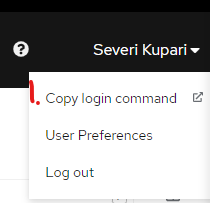

# How to use swagger endpoints in openshift environment

1. Open openshift website, then find in right corner and press the "Copy login command" below your profile name 
2. Run the command in command line `oc login --token=XXX --server=XXX`
3. Select correct project `oc project XXX`
4. Find pod name, CHANGE_ME to events returns first events-api pod name `oc get pods | grep CHANGE_ME | awk '{print $1}'`
5. Open tunnel to pod in port 8080, `oc port-forward POD_NAME 8080:8080`
6. Then you can open swagger on your local computer in [http://localhost:8080/swagger-ui/#/](http://localhost:8080/swagger-ui/#/) 

# How to use swagger endpoint using infra/runConfigurations on intellij idea ultimate.

* [Events-API swagger](http://localhost:8080/swagger-ui/#/)
* [Cart-API swagger](http://localhost:8180/swagger-ui/#/)
* [Message-API swagger](http://localhost:8181/swagger-ui/#/)
* [Mock-API swagger](http://localhost:8182/swagger-ui/#/)
* [Order-API swagger](http://localhost:8183/swagger-ui/#/)
* [Payment-API swagger](http://localhost:8184/swagger-ui/#/)
* [Price-API swagger](http://localhost:8185/swagger-ui/#/)
* [Product-API swagger](http://localhost:8186/swagger-ui/#/)
* [Mapping/ServiceConfiguration-API swagger](http://localhost:8187/swagger-ui/#/)
* [Merchant-API swagger](http://localhost:8188/swagger-ui/#/)
* [History-API swagger](http://localhost:8189/swagger-ui/#/)
