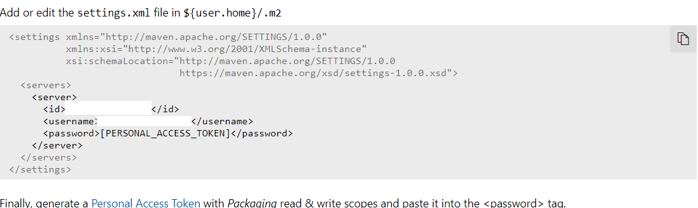

#How to use backend with docker guide
###You need to create settings.xml file to users/username/.m2/ folder

## 1. Get server id, username and personal access token from azure portal
[https://dev.azure.com/City-of-Helsinki/talpa-verkkokauppa/_packaging?_a=feed&feed=talpa-artifacts](https://dev.azure.com/City-of-Helsinki/talpa-verkkokauppa/_packaging?_a=feed&feed=talpa-artifacts)

* Open artifacts 
* Select talpa-artifacts
* Press "Connect to feed" button
* Press "Maven"
* Then you see id and username
* Then you need to create Personal Access Token [https://dev.azure.com/City-of-Helsinki/_usersSettings/tokens](https://dev.azure.com/City-of-Helsinki/_usersSettings/tokens)
  * Create read only token! 
* Finally, generate a Personal Access Token with Packaging read scope and paste it into the <password> tag.
  * users/username/.m2/settings.xml 

## 3. Now you can start backend docker-compose with command
### Run on verkkokauppa-core folder.
`docker-compose up --build`

### Extra information
Spring applications waits for elasticsearch to be up before starting using wait-for-it.sh script.

There can be some errors connecting to elasticsearch when applications starts but check that indices exists.

### Create test configurations with get requests to productmapping endpoints.

###
GET http://localhost:8187/serviceconfiguration/initializetestdata

###
GET http://localhost:8187/productmapping/initializetestdata

###
GET http://localhost:8187/servicemapping/initializetestdata

### When these are done, you can test backend functionality with Kassa-ui

* Get product id from products indices
* Change this PRODUCTID id on url to product id from indices.   
* http://localhost:3000/purchase/PRODUCTID?language=fi&quantity=1&namespace=venepaikat
* Now it should work! Remember to setup experience api to run on docker too!